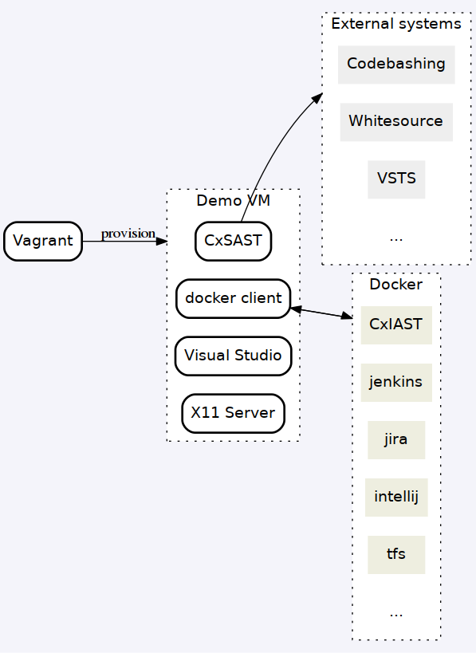
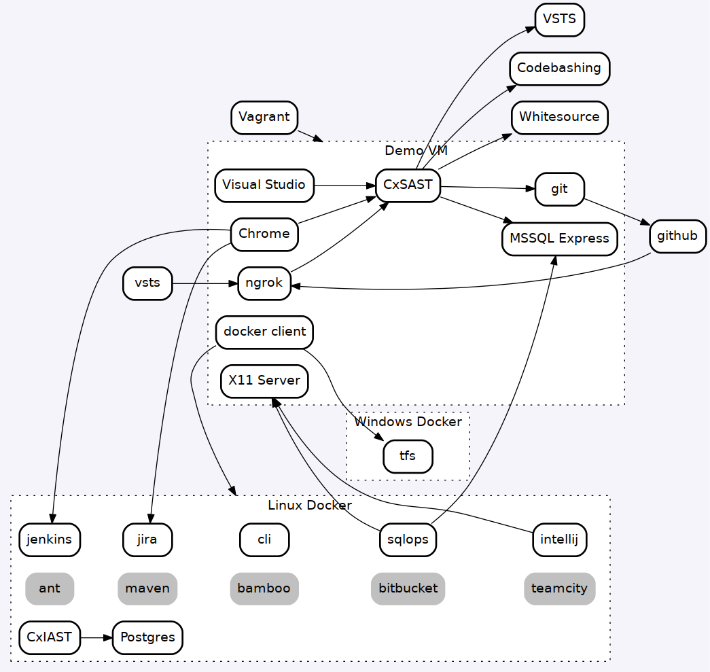

# A minimal viable CxSAST demo VM platform
A vagrant managed Virtual Machine capable of demonstrating majority of the Checkmarx plaftorm's capabilities, while using the least possible resources from the host. It is intended be used for demo, PoC and integration testing.

## Features
* Runs most third party integrations (Jenkins, Jira, IntelliJ etc) as docker containers on a per-need basis. The containers are stored and run outside of the VM, so no space, cpu or memory is used from the VM.
* The VM creation and provisioning is fully automated through vagrant, so you can change, destroy and recreate the VM as needed. One example would be if you want to upgrade CxSAST or if trial licenses expired and need to be renewed. All required third-party software is downloaded, installed and configured when the VM is started for the first time.
* Runs without a need for internet connection
* The base OS (Windows 2016 Server) is slimmed down and tuned for demo use. It can be updated via vagrant's box autoupdate mechanism.

### Setup
Copy CxSetup.exe to the folder with the vagrantfile and run `vagrant up`.

### Software installed by the scripts
* CxSAST
* Chrome
* Webex
* Docker client
* Git client
* X11 server - for graphical docker containers
* Far Manager - light weight orthodox file manager
* ngrok - port forwarder to simplify webhook configuration

### Integrations configured
* Jenkins - external docker container based on the [cxai/cxjenkins](https://hub.docker.com/r/cxai/cxjenkins/) image. To run type `jenkins` in the command line
* Jira - external docker container, [cxai/cxjira](https://hub.docker.com/r/cxai/cxjira/). Start as `jira`
* IntelliJ - external docker container, [cxai/cxintellij](https://hub.docker.com/r/cxai/intellij). Start as `ij`
* Checkmarx CLI - external docker container, [cxai/cxcli](https://hub.docker.com/r/cxai/cxcli). Run as `cxcli`
* MSSQL GUI client - MSSQL Operations studio docker container [alexivkin/mssqlops](https://hub.docker.com/r/alexivkin/mssqlops/). Run as `sqlops`
* more coming
* Visual Studio - Visual Studio 2017 Community edition is not dockerizable as there is no currently available way to dockerize Windows GUI apps, so it is installed on the VM. After the plugin is  [configured](https://checkmarx.atlassian.net/wiki/spaces/KC/pages/126463827/Setting+Up+the+CxSAST+Visual+Studio+Plugin+v8.4.1+and+up) you can create a new project from a git repo like [this one](https://github.com/cxai/WebGoat.Net). To run type `vs`.
* Codebashing - Make sure you have the correct license (op based, cb enabled) and follow [these steps](https://checkmarx.atlassian.net/wiki/spaces/KC/pages/224952398/Enabling+Codebashing+Add-on+v8.5.0+and+up)

# Important notes
1. All pre-configured users/passwords are set to admin/admin
2. Many third party components require configuration the first time you start them. They use persistent storage, so you only need to do it once, even if you remove and recreate the VM. The [source for the dockerfiles](https://github.com/alexivkin/Docker-CxIntegrations/) includes notes on the first-time configuration.

# Architecture
## High level


## Detailed

## Using external docker containers
Make sure your docker host accepts external connections. I.e the 2375 port is open and the docker service is listening on TCP.
For Ubuntu:
```
sudo vi /etc/systemd/system/docker.service.d/override.conf
[Service]
ExecStart=
ExecStart=/usr/bin/dockerd -H fd:// -H tcp://0.0.0.0:2375

sudo systemctl daemon-reload
sudo systemctl restart docker.service
```
For Windows:
`echo '{ "hosts": ["tcp://0.0.0.0:2375", "npipe://"] }' | out-file -encoding ascii c:\ProgramData\docker\config\daemon.json`
